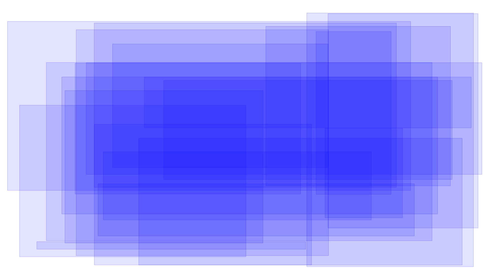

# OctoBox

## Classic Bounding Boxes

Every graphic programmer knows what’s a bounding box.
It’s a data structure which represents axis-aligned box with outer bounds of something more complex, like a mesh, polyline, or a set of many points.

In case of 2D, the box contains 4 numbers, often represented as a structure with 4 fields: left, top, right, and bottom.

## Disadvantages

These boxes are simple and efficient, and widely used all over the software and even hardware, but sometimes they’re just not enough.

One use case is computing bounding box of another box that was rotated or otherwise transformed.
If you rotate an axis-aligned square by 45° and compute axis-aligned box of a rotated one, you’ll get a square with area twice as large.

Other times you’d want to do optimize first steps of collision detection by testing just the boxes of things, again extra unused area reduces efficiency.

It’s possible to compute convex hull or an approximation of that, but that thing is expensive to compute and takes lots of memory, not much cheaper to handle than the original geometry.

Can we do better?

## Better Boxes

It appears we can.

Long story short, an octobox is a data structure with 8 fields, computed as such: 
`min(x)`, `min(y)`, `min(x+y)`, `min(x-y)`, `max(x)`, `max(y)`, `max(x+y)`, `max(x-y)`.

Geometrically, these 8 values can be visualized as a set of 8 bounding planes, 4 of them axis aligned, 4 of them rotated 45° degrees, touching the input thing from the outside. 
Or alternatively, as an intersection of 2 bounding boxes, one axis aligned another one rotated 45°.

### What makes them good?

By dropping 4 fields out of 8, we can get an axis-aligned box containing the octabox. 
Some graphics operations do need the normal boxes.

Rotating an octobox by 45° results in the octobox of the same area.
The worst case is rotating by 22.5°, but even then, the area only increases by a small fraction, not by a factor of 2 like it happens with regular boxes.

An FP32 octobox only takes 32 bytes of memory, this means you don’t need dynamic memory allocations, and can fit 2 of them in a cache line.

An octobox fits in vector registers.
When these fields are 32-bit floats, or 32-bit integers, the complete octobox fits in two 128-bit vector registers, one with minimum values, another one with maximum values.
All modern processors (x86, AMD64, ARM) have vector instructions to handle such structures very efficiently.
CPUs have vector min/max instructions to update boxes, vector comparison instructions to test boxes for intersections, and so on.
And if you have AVX, you can even place the complete box into a single register, invert signs of the last 4 values to be able to use `vminps` instruction to merge or extend the octoboxes.

These hardware features make octoboxes very fast. Definitely fast enough for a quick rejection step before running more expensive collision/intersection algorithms.

Finally, for debug visualization you can convert an octobox into a polygon with up to 8 vertices, that makes debug visualization way more readable when there’re many of them on the screen.

Initially I didn’t want to include source code in this article, but this point deserves an illustration. See the `DemoApp` in this repository, it builds a C# console application which outputs SVG file with 22 of them. The app requires .NET 5.0 SDK to build and an x86 CPU to run.

Here’a an animation cycling between traditional boxes and octoboxes for the same random input. 
Note how these extra diagonal lines allow to track boxes more easily.



## 3D Generalization

It’s quite easy to extend that idea to 3D.
I don’t know how to name that thing and I have not used it much, but for 3D you can have a data structure with 12 numbers.

The 6 of them is same as for the 3D box, other four are `min(x+y+z)`, `min(-x+y+z)`, `min(x-y+z)`, `min(-x-y+z)`, and the final 4 are the maximum of these same 4 values, `max(x+y+z)`, `max(-x+y+z)`, `max(x-y+z)`, `max(-x-y+z)`.

Geometrically, that can be interpreted as a union of bounding box in the first 6 elements, and a bounding irregular octahedron in the last 8 elements.

